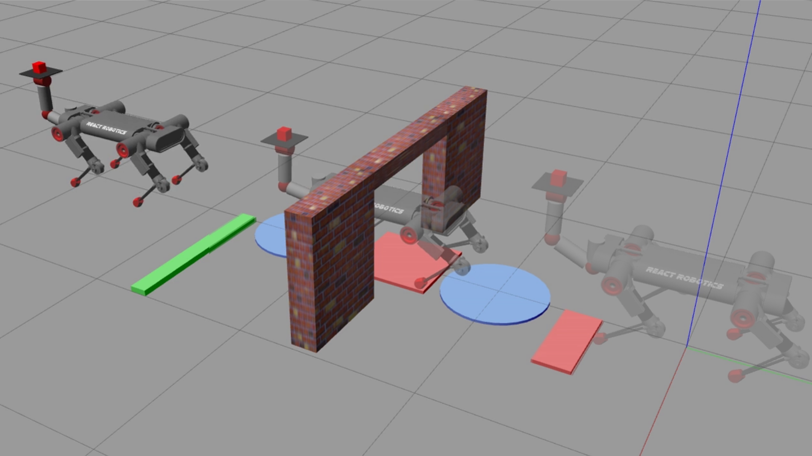

# Nonprehensile Object Transportation with a Legged Manipulator

Data and implementation of the nonprehensile object transportation method for legged robots developed in the paper:

*[V. Morlando](),
[M. Selvaggio](http://wpage.unina.it/mario.selvaggio/index.html), [F. Ruggiero](http://www.fabioruggiero.name/web/index.php/en/), "[Nonprehensile Object Transportation with a Legged Manipulator](http://www.fabioruggiero.name/web/files/Papers/C38.pdf)", in Proc. IEEE Int. Conf.
Robot. Autom., Philadelphia, USA, 2022, p. to appear.

[](ttps://youtu.be/eT-N4kTAC8g)

### Citing
```
@article{MorlandoRAL2021,
  title={Nonprehensile Object Transportation with a Legged Manipulator},
  author={Morlando, Viviana and Selvaggio, Mario and Ruggiero, Fabio},
  booktitle={2022 IEEE International Conference on Robotics and Automation},
  year={2022},
  organization={IEEE}
}
```

# Instructions

The code was tested with Ubuntu 20.04, and ROS Noetic. Different OS and ROS versions are possible but not supported.

### Install dependencies

`sudo apt-get install ros-noetic-ros-control ros-noetic-ros-controllers`


### Clone the following packages 

### Clone the following packages 

```cd <CATKIN_WS_DIR>/src```

`git clone https://github.com/Viviana-Morl/Dogbot_manipulator.git`

`git clone https://github.com/Viviana-Morl/legged-nonprehensile-manipulation.git`

`git clone https://github.com/ros/kdl_parser.git`

### Compile 

`catkin_make -DCMAKE_BUILD_TYPE=Release`

### Run simulation

`roslaunch dogbot_gazebo gztest.launch paused:=true `

`rosrun dogbot_waiter waiter [path]/[to]/[DogBotV4]/dogbot_description/urdf/dogbot.urdf`

Press play in gazebo to start the simulation
